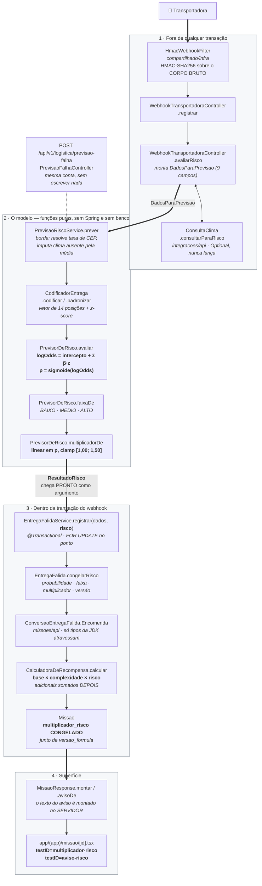

# AI Logistics Extension

**O componente de IA do Omni-Tribo.** É um modelo de previsão de risco de falha de entrega —
regressão logística interpretável, em Java puro — que estima, no instante em que a transportadora
reporta uma entrega frustrada, qual a probabilidade de a *próxima* tentativa naquele endereço também
falhar.

Essa probabilidade não é um número de painel: ela **reprecifica a missão comunitária** que nasce da
entrega falida, prioriza o alerta enviado aos vizinhos e vira um aviso acionável na tela de quem vai
executar. É o ponto em que a extensão logística do desafio toca dinheiro, atenção e comportamento.

| | |
|---|---|
| Decisão que o criou | [ADR 0022 — Previsão de risco de entrega](adr/0022-previsao-de-risco-de-entrega.md) |
| Métricas, matriz de confusão e limites | [`docs/qualidade/modelo-previsao.md`](qualidade/modelo-previsao.md) |
| Sequência completa do webhook | [`docs/diagramas/sequencia-entrega-falida.md`](diagramas/sequencia-entrega-falida.md) |
| Artefato treinado (os números) | `app.logistica.risco`, em `services/api/src/main/resources/application.yml` |
| Modelo (o código) | `services/api/src/main/java/com/omnitribo/logistica/dominio/` |

---

## O caminho do dado, ponta a ponta

Cada nó traz o arquivo e o método reais. O diagrama é um **fluxo**, e não uma sequência, de
propósito: a sequência do webhook inteiro — incluindo custódia, outbox e fan-out — já está em
[`sequencia-entrega-falida.md`](diagramas/sequencia-entrega-falida.md), e duplicá-la aqui criaria uma
segunda fonte de verdade para o mesmo fato. O que este diagrama isola é só o percurso do **sinal de
IA**, do corpo bruto do webhook até o pixel na tela.



### Por que a previsão acontece FORA da transação

`EntregaFalidaService.registrar` é `@Transactional` e a primeira coisa que faz é
`SELECT … FOR UPDATE` no ponto de custódia. Consultar o provedor de clima lá dentro seguraria esse
lock durante uma chamada de rede — e, sob rajada de webhooks contra o mesmo ponto, as transações
enfileirariam atrás de um lock preso por I/O externo. É o mesmo desenho que derrubou o check-in da
F6 e levou o projeto a proibir `REQUIRES_NEW` no caminho de valor.

Por isso o `ResultadoRisco` é **parâmetro** de `registrar`, e não algo que ele calcula. Fora da
transação, o pior caso de um provedor lento é a latência do webhook — limitada pelo timeout de 2 s e
pelo bulkhead —, e nenhum lock fica esperando.

### O congelamento é duplo, e não redundante

- `entrega_falida` guarda `risco_probabilidade`, `risco_faixa`, `risco_multiplicador` e
  `risco_versao_modelo` (V22). Existe para haver **contra o que comparar** quando dados reais de
  desfecho chegarem: sem previsões registradas, não haveria como medir se o modelo acertou.
- `missao.multiplicador_risco` guarda o fator efetivamente aplicado, junto de `versao_formula`. É a
  resposta para *"este crédito estava certo quando foi feito?"* depois de o modelo mudar.

---

## As features, e o sinal de cada uma

São **14 características**, e a ordem de declaração em `CaracteristicaRisco` é o contrato do vetor —
o índice de cada uma é o próprio `ordinal()`. Os coeficientes abaixo são copiados literalmente de
`app.logistica.risco.coeficientes`.

**Intercepto: `-1.839341`** — o log-odds da entrega média nas categorias de referência (manhã, dia
útil, endereço residencial, numéricas na média do treino).

| Característica | Tipo | β publicado | O que a presença/aumento faz |
|---|---|---:|---|
| `TENTATIVAS_ANTERIORES` | numérica | **+0.695670** | quem já falhou tende a falhar de novo — o sinal mais forte entre as numéricas |
| `JANELA_NOITE` (18–21h) | indicador | **+0.645797** | jantar, interfone sem resposta, portaria em troca de turno |
| `ENDERECO_RURAL` | indicador | **+0.645820** | acesso difícil, endereçamento impreciso |
| `ENDERECO_CONDOMINIO` | indicador | +0.592997 | portaria com regra própria: recusa por horário ou por falta de autorização |
| `ENDERECO_COMERCIAL` | indicador | +0.449118 | efeito **isolado** pequeno: em dia útil, comércio recebe bem |
| `COMERCIAL_EM_FIM_DE_SEMANA` | indicador (interação) | **+0.977445** | comércio fechado no sábado — ver a nota sobre interação, abaixo |
| `JANELA_TARDE` (12–17h) | indicador | +0.313348 | |
| `JANELA_MADRUGADA` (22–05h) | indicador | +0.230863 | fora de qualquer janela em que alguém receba |
| `FIM_DE_SEMANA` | indicador | **−0.304030** | o único **negativo**: residencial falha *menos* no fim de semana, porque as pessoas estão em casa |
| `TAXA_HISTORICA_CEP` | numérica | +0.350997 | histórico da faixa de CEP (3 dígitos); faixa desconhecida cai na média e contribui **zero** |
| `TEMPERATURA_C` | numérica | +0.158474 | |
| `PESO_KG` | numérica | +0.152186 | volume pesado exige alguém *apto* a receber, não só presente |
| `CHUVA_MM` | numérica | +0.144731 | chuva atrasa a rota e desestimula descer para receber |
| `VOLUME_L` | numérica | +0.000854 | praticamente nulo no modelo publicado |

**As três coisas que essa tabela só significa se forem ditas em voz alta:**

1. **Numérica e indicador não se leem na mesma unidade.** Numérica é padronizada (z-score), então β
   é *log-odds por 1 desvio-padrão*. Indicador **não** é padronizado, então β é *log-odds pela
   presença*, relativo à categoria de referência. Padronizar um indicador produziria "log-odds por
   desvio-padrão de um indicador", que não significa nada em português — e faria a AUSÊNCIA da
   característica contribuir com um valor negativo diferente de zero.
2. **Duas categorias não aparecem na lista, e isso é obrigatório.** `MANHA` (06–11h) e `RESIDENCIAL`
   são as **referências descartadas**. Com todas as dummies presentes, a soma delas seria sempre 1,
   o intercepto viraria combinação linear delas e o sistema ficaria indeterminado — a regularização
   escolheria arbitrariamente entre infinitas soluções e o coeficiente perderia interpretação.
   Descartando a referência, `β(ENDERECO_RURAL) = +0,65` lê-se exatamente como *"endereço rural soma
   0,65 ao log-odds em relação a um residencial equivalente"*.
3. **`COMERCIAL_EM_FIM_DE_SEMANA` é o produto de duas outras colunas, oferecido de propósito.**
   Regressão logística é aditiva no log-odds e **não descobre interação sozinha**: sem esse termo, o
   modelo apenas somaria "comercial" (+0,45) e "fim de semana" (−0,30) e concluiria que sábado é
   *melhor* para o comércio. É uma limitação medida do modelo linear — uma árvore acharia a interação
   por conta própria — registrada no ADR 0022 em vez de escondida.

### Limiares

```
limiar-alto:  0.19    ← é o limiar de DECISÃO do modelo ("vai falhar")
limiar-medio: 0.10    ← exatamente a metade dele
```

`0,19` está bem abaixo de `0,50` porque o custo do erro é assimétrico: um falso negativo gera missão
subvalorizada, sem prioridade e sem aviso; um falso positivo custa um prêmio limitado em token e uma
notificação. O limiar foi escolhido por varredura na partição de **validação** — nunca na de teste,
que reportaria um recall otimista.

`ALTO` começa **exatamente** no limiar de decisão para que a interface nunca diga "risco ALTO" num
caso que o próprio modelo classificou como sucesso.

---

## Como a previsão vira dinheiro

```
multiplicador = 1,00 + (1,50 − 1,00) × probabilidade,   sempre dentro de [1,00; 1,50]
```

Linear, e não uma curva: *"o dobro do risco paga o dobro do adicional"* é a única forma que se
explica numa frase; qualquer curva exigiria defender o formato dela.

**O multiplicador entra na BASE, junto da complexidade — nunca sobre o total.**

```java
BigDecimal total = new BigDecimal(base).multiply(multiplicador).multiply(risco);
total = total.add(adicionalDistancia(...));
total = total.add(adicionalPeso(...));
total = total.add(adicionalVolume(...));
total = total.add(adicionalValorOfertado(...));
```

Multiplicar o total foi **recusado** por ter efeito perverso: uma entrega longa e pesada num endereço
arriscado veria os três adicionais escalados juntos, e a recompensa explodiria de forma não linear
justamente no caso extremo. Na base, o risco reprecifica a **dificuldade intrínseca** da missão, que
é o que ele mede.

Três consequências que valem estar escritas:

- **O clamp é duplo, e o segundo não é redundância.** `PrevisorDeRisco.multiplicadorDe` já limita na
  origem; `CalculadoraDeRecompensa.multiplicadorDeRiscoEfetivo` limita de novo porque é a última
  função pura antes do congelamento em banco e não pode confiar em quem a chamou.
- **Piso 1,00: risco nunca REDUZ recompensa**, o que inverteria a tese do produto. `ParametrosRisco`
  derruba o boot se alguém publicar mínimo abaixo de 1,0.
- **Nenhuma missão que cunha token recebe multiplicador.** Só o webhook produz multiplicador
  diferente de 1, e toda missão desse caminho nasce `fonte_pote = PATROCINADOR` — paga do pote
  financiado pela transportadora. A que ainda cunha é a ENTREGA criada por humano, que nunca é
  avaliada e recebe o neutro 1,00. O teto de 1,50 limita hoje **quanto a transportadora paga por
  conversão**, não a emissão de moeda.

O teto está duplicado em dois lugares do YAML (`app.missoes.recompensa.multiplicador-risco-*` e
`app.logistica.risco.multiplicador-*`) e `CoerenciaTetoRiscoTest` falha se divergirem: recalibrar o
modelo não deve conseguir, sozinho, ampliar quanto a economia se dispõe a pagar.

---

## Onde o usuário vê isso

Tudo em `apps/mobile/app/(app)/missao/[id].tsx`:

| testID | O que mostra | Quando aparece |
|---|---|---|
| `multiplicador-risco` | `Inclui 1,32× por risco de falha na entrega`, dentro do bloco de recompensa | só quando `multiplicadorRisco > 1` — exibir "1,00×" em toda missão comum seria ruído |
| `aviso-risco` | um `<Aviso>` com tom `atencao` (ALTO) ou `informacao` (MEDIO), **antes** do bloco "Onde" | só quando o servidor mandou texto: nulo em risco BAIXO e em toda missão que não veio de entrega falida |

Duas decisões de desenho aí dentro:

- **O texto do aviso é montado no SERVIDOR** (`MissaoResponse.avisoDe`), não no app. Se o app
  compusesse a frase a partir da faixa, cada versão instalada teria a sua e mudar a orientação
  exigiria publicar na loja. E o aviso **diz o que fazer**, não só o que temer: *"Combine o horário
  com o destinatário antes de ir"* é o comportamento que efetivamente reduz a chance de a segunda
  tentativa também falhar.
- **O aviso fica antes do endereço** de propósito: quem está decidindo se aceita precisa ler o
  alerta antes de passar pelo bloco "Onde", não depois.

A faixa também sai do app: ela viaja no evento da outbox para o fan-out priorizar, e risco `ALTO` tem
teto próprio de alertas por hora (`app.notificacoes.alertas-alta-prioridade-por-hora: 8`) — folga
sobre o teto normal de 5, para que cinco entregas triviais chegando antes não silenciem a difícil
pela hora seguinte.

---

## Honestidade: o que isto demonstra, e o que não demonstra

> **Os dados são SINTÉTICOS.** As 5.000 entregas foram geradas por
> `GeradorDatasetEntregas`, e as correlações que o modelo aprendeu foram **injetadas por nós**, com
> semente fixa. Não há um único registro de operação real neste treino.

O que a AI Logistics Extension **demonstra** é um mecanismo completo funcionando ponta a ponta —
gerar, treinar, medir, selecionar limiar, publicar, inferir, explicar, congelar e reprecificar — e a
capacidade de justificar cada previsão individual pelos fatores que mais pesaram nela.

O que ela **não** demonstra é que o modelo prevê falhas de entrega no mundo real. Nenhuma métrica em
[`docs/qualidade/modelo-previsao.md`](qualidade/modelo-previsao.md) deve ser lida como se
demonstrasse, e o documento abre declarando exatamente isso.

**A validação com dados reais é o próximo passo declarado**, e está registrada como tal no ADR 0022 —
não como trabalho desta entrega. Ela exige o que hoje não existe: um volume de entregas falidas reais
com desfecho observado. É precisamente por isso que `entrega_falida` grava a previsão de cada caso.

Um modelo honesto sobre dados sintéticos é defensável. Um modelo apresentado como treinado em dados
reais desmonta na primeira pergunta.

---

## Como reproduzir

```bash
bash tools/dataset/gerar.sh
```

Escreve três artefatos em `tools/dataset/`: `entregas-sinteticas.csv` (as 5.000 linhas),
`coeficientes.yml` (o bloco pronto para colar) e `relatorio.md` (métricas, matriz de confusão e
varredura de limiar). O pipeline inteiro é função pura sobre uma semente fixa — sem Spring, sem
Testcontainers.

**Você quase nunca precisa rodá-lo**, porque `./mvnw verify` já re-treina o modelo do zero a cada
build. `ModeloRiscoTreinoTest` compara cada coeficiente treinado contra o que está publicado no
`application.yml`, com tolerância de `5e-7` — meia unidade da última casa decimal gravada, ou seja,
exatamente o erro de arredondamento e nada além dele.

**Consequência prática: editar um coeficiente à mão quebra o build.** É de propósito, no mesmo
espírito de `CalculadoraDeRecompensaTest.douradoV1`. Se o teste quebrou e a mudança foi intencional,
o conserto **não** é afrouxar a tolerância — é:

1. `bash tools/dataset/gerar.sh`
2. colar `tools/dataset/coeficientes.yml` em `app.logistica.risco`, no `application.yml`
3. **subir `app.logistica.risco.versao`**
4. atualizar o digest em `DatasetSinteticoTest`, se o dataset mudou
5. atualizar `docs/qualidade/modelo-previsao.md` com os números novos

O passo 3 não é burocracia: o multiplicador derivado desses números fica **congelado** em
`missao.multiplicador_risco` e em `entrega_falida`. Sem a versão, some a resposta para *"este
multiplicador estava certo quando foi aplicado?"*.

O que também quebra o build de propósito: reordenar, inserir ou remover uma constante de
`CaracteristicaRisco`. O índice de cada característica é o `ordinal()`, então mexer na ordem faria o
modelo somar o coeficiente de uma característica sobre o valor de outra — silenciosamente, sem erro
de compilação e com probabilidades que continuariam plausíveis.
