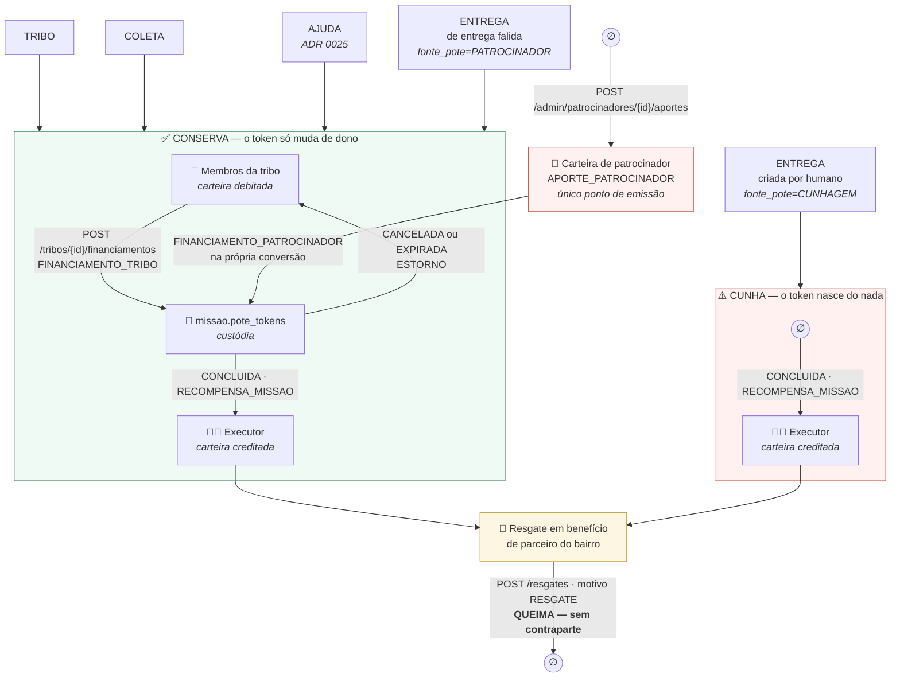
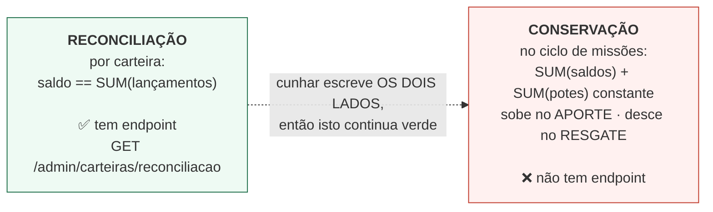

# Fluxo econômico — quem financia, onde o token nasce, onde ele morre

Três moedas, e só uma circula no ciclo de missões.
Ver [ADR 0009](../adr/0009-economia-do-cuidado-token-como-recompensa.md).

| Moeda | Papel | Circula? |
|---|---|---|
| **XP** | reputação — deriva o nível, filtra elegibilidade | não é transferível, não tem ledger, só cresce |
| **TOKEN** | moeda comunitária — recompensa de **todas** as categorias | sim, transferível dentro da tribo |
| **BRL** | **fora do ciclo de missões** | `ck_missao_economia` exige `valor_brl = 0` em toda missão |

**A premissa que governa tudo: quem cria a missão NÃO paga.** A recompensa é calculada pelo servidor
e congelada na criação — o DTO de criação não tem `xpRecompensa` nem `tokensRecompensa`.

---

## Por onde o TOKEN entra e sai

## O que o diagrama admite

**As duas lacunas que este diagrama registrava foram FECHADAS**, e a seção continua aqui porque a
razão de cada uma explica o desenho atual. (Até 2026-09-09 o diagrama acima ainda desenhava as duas
como tracejadas e inexistentes, contradizendo o texto logo abaixo, que já dizia o contrário.)

**1. O patrocinador não existia — e passou a existir.** Até 2026-08-20, ENTREGA e AJUDA cunhavam.
Medido do zero em 2026-08-16: um ciclo AJUDA aumentou `SUM(saldos) + SUM(potes)` em exatamente o
valor da recompensa, enquanto um ciclo TRIBO financiado deixou a soma parada
([evidência de época](../evidencias/f13-conservacao-por-categoria.md)).

Aquilo **não tinha sido contornado por esquecimento**. Exigir pote para ENTREGA faria membros da
tribo custearem a logística do varejista — o inverso do modelo. O financiador correto é o
patrocinador: entrega que falhou custa re-entrega, armazenagem e risco de perder o cliente, então
patrocinar o pote sai mais barato que o fracasso. É esse o caso de negócio, e preferiu-se **uma
lacuna documentada a uma regra errada codificada** enquanto ele não estava implementado.

**Hoje está.** A carteira de patrocinador chegou no [ADR 0024](../adr/0024-carteira-de-patrocinador.md)
(`V23`), AJUDA passou a pagar do pote no [ADR 0025](../adr/0025-ajuda-paga-do-pote.md), e o resgate
virou o sumidouro no [ADR 0027](../adr/0027-resgate-queima-token.md). A emissão saiu da conclusão e
virou um ponto só, `APORTE_PATROCINADOR`. Medição de 2026-08-22: **Δ=0 nas quatro categorias**
([evidência](../evidencias/f14-conservacao-quatro-categorias.md)).

O que **ainda** cunha é ENTREGA criada por humano — sem transportadora, não há patrocinador a
debitar. Ela é `FontePote.CUNHAGEM`, declarada na linha da missão.

**2. O resgate não tinha sumidouro no backend — e passou a ter.** Enquanto o catálogo de benefícios
era dado local do app, não havia tabela de parceiro, endpoint nem motivo `RESGATE` no ledger, e
simular o débito no cliente produziria um saldo que o servidor desmente no primeiro `refetch`.

**Hoje existe.** `POST /api/v1/resgates` ([ADR 0027](../adr/0027-resgate-queima-token.md)) debita com
motivo `RESGATE` e **não credita ninguém** — sem contraparte, sem missão. É a ponta de BAIXA da
conservação, simétrica ao `APORTE_PATROCINADOR`: a soma `SUM(saldos) + SUM(potes)` sobe numa e desce
na outra, e é constante entre as duas. Por isso a conservação é de CICLO, não de estoque.

## O multiplicador de risco NÃO amplia a cunhagem — e essa frase já esteve invertida aqui

Missão nascida de entrega falida recebe multiplicador ∈ **[1,00; 1,50]**, congelado na linha junto
com `versao_formula`.

Até 2026-09-09 esta seção dizia "como ENTREGA cunha, risco alto cunha até 1,5× o que cunharia".
**Isso deixou de valer com a V23.** O multiplicador só é produzido no caminho do webhook, e toda
missão desse caminho é `fonte_pote = PATROCINADOR` — paga do pote da transportadora. A ENTREGA que
cunha é a criada por humano, e essa nunca é avaliada: recebe 1,00. **Nenhuma missão que cunha recebe
multiplicador.**

O teto continua estreito, existe em dois blocos de configuração e tem um teste
(`CoerenciaTetoRiscoTest`) travando a concordância entre eles — mas hoje o que ele limita é **quanto
a transportadora paga por conversão**, não a emissão. E o excedente não vira token do nada: um
multiplicador que estoure o saldo do patrocinador faz `debitarPatrocinador` devolver vazio, e a
entrega falida vira SEM_PATROCINIO em vez de missão. O valor 1,50 não foi mexido junto com esta
correção — mudá-lo é recalibrar fórmula e exige subir `versao`.

O multiplicador entra na **BASE** do cálculo, junto da complexidade — nunca sobre o total.
Multiplicar o total escalaria também distância, peso e volume, e a recompensa explodiria de forma
não linear no caso extremo.

## As duas invariantes, que não são a mesma

Uma invariante que ninguém mede não está garantida. A história de como o projeto descobriu isso está
em [`../EVOLUCAO-ARQUITETURAL.md`](../EVOLUCAO-ARQUITETURAL.md).
