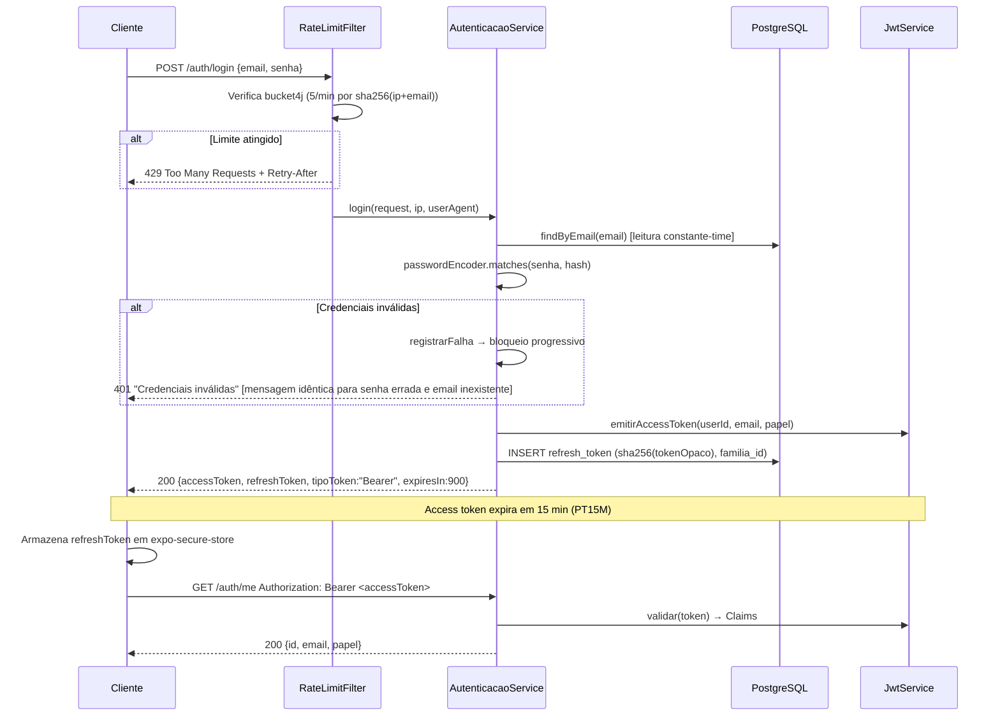
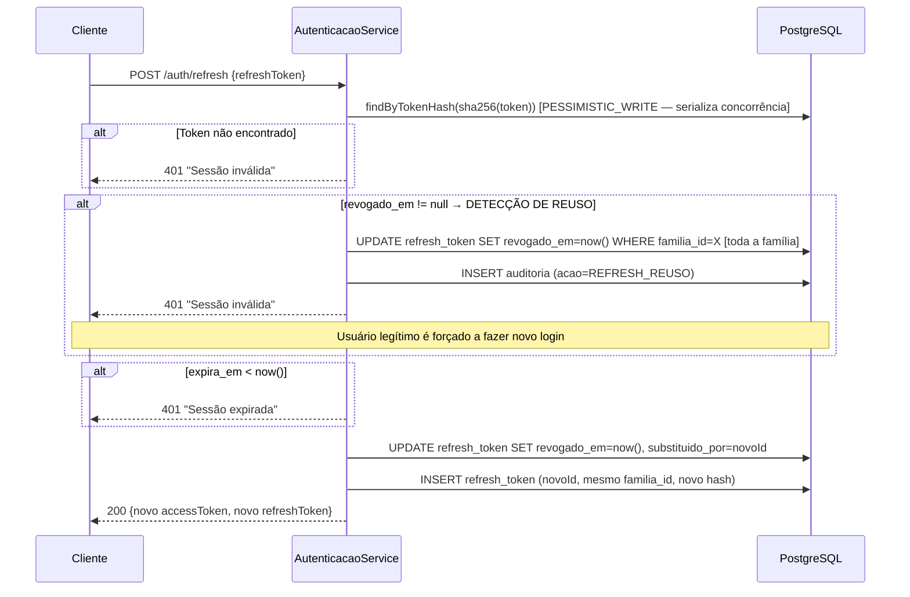

# Segurança — Autenticação (F2)

## Fluxos

### Login e uso de access token



### Rotação de refresh token



### Detecção de reuso — cenário de ataque

```mermaid
sequenceDiagram
    participant U as Usuário legítimo
    participant A as Atacante
    participant AS as AutenticacaoService

    Note over U,AS: T1: Login → família F1, token V1
    U->>AS: POST /auth/refresh (V1) → V2 [V1 revogado]
    A->>AS: POST /auth/refresh (V1) [V1 já revogado!]
    AS->>AS: revogado_em != null → REUSO DETECTADO
    AS->>AS: Revoga TODA a família F1 (V2 e qualquer filho)
    AS-->>A: 401 Sessão inválida
    U->>AS: POST /auth/refresh (V2) [V2 também revogado agora]
    AS-->>U: 401 Sessão inválida → novo login obrigatório
    Note over U,AS: Sessão comprometida é isolada; atacante não pode usar V2
```

## Medidas e ataques mitigados

| Medida de segurança | Ataque(s) mitigado(s) |
|---|---|
| **Argon2id** (memory-hard, 16 MB, 2 iter) | Brute-force offline de hashes vazados; ataques com GPU/ASIC |
| **RS256 assimétrico** (RSA 2048 bits) | Verificação distribuída sem expor chave privada; comprometimento de verificador não compromete emissão |
| **JWT TTL 15 min** | Janela de comprometimento de access token sem revogação no servidor |
| **Refresh com rotação** + `PESSIMISTIC_WRITE` | Roubo silencioso de refresh token; race condition na rotação concorrente |
| **Detecção de reuso** (revogação de família) | Uso de refresh token roubado após rotação legítima (RFC 6819 §5.2.2.3) |
| **Rate limiting** Bucket4j 5/min por sha256(ip+email) | Credential stuffing automatizado; enumeração de senhas por força bruta |
| **Bloqueio progressivo** 10 falhas → 15 min | Brute-force manual/lento que respeita rate limits |
| **Mensagem genérica** em login | Enumeração de usuários via resposta diferenciada |
| **JWT stateless** sem userId no corpo | IDOR (Insecure Direct Object Reference) — id vem sempre do token |
| **sha256(token)** armazenado, não o valor bruto | Comprometimento do banco não expõe tokens válidos |
| **Valor opaco 256 bits** (SecureRandom) | Previsibilidade/adivinhação de refresh token |
| **HSTS** (max-age 31536000, includeSubDomains) | Downgrade para HTTP; interceptação TLS |
| **X-Frame-Options DENY** | Clickjacking via iframe |
| **X-Content-Type-Options nosniff** | MIME sniffing pelo browser |
| **CSP** `default-src 'none'; frame-ancestors 'none'` | XSS (em API pura, contexto preventivo) |
| **CORS** lista explícita, sem wildcard | Amplificação de CSRF cross-origin em browsers |
| **CSRF desabilitado** com justificativa | Não aplicável: API stateless com Bearer header (não cookie) |
| **Validação geoespacial e de saldo no servidor** | Manipulação de valores calculados no cliente |
| **Senha mínimo 12 chars + lista senhas comuns** | Senhas fracas previsíveis; credential stuffing com top-N |

## Configuração de referência

```yaml
app:
  jwt:
    ttl-access: PT15M           # Access token: 15 minutos
    chave-privada-caminho: ${JWT_PRIVATE_KEY_PATH:keys/private.pem}
    chave-publica-caminho: ${JWT_PUBLIC_KEY_PATH:keys/public.pem}
  rate-limit:
    login-por-minuto: 5
    falhas-para-bloqueio: 10
    janela-falhas-minutos: 15
    duracao-bloqueio-minutos: 15
```

Refresh token TTL: 30 dias (hardcoded em `AutenticacaoService.TTL_REFRESH`).

## Checklist de defesa em profundidade

- [ ] Credencial em `expo-secure-store` no mobile (nunca `AsyncStorage`)
- [ ] `Authorization: Bearer` extraído apenas no servidor via `JwtAuthFilter`
- [ ] Nenhum log com senha, token, refresh, coordenada exata ou payload autenticado
- [ ] Flyway como única fonte de schema; `ddl-auto: validate`
- [ ] Erros retornam RFC 9457 ProblemDetail sem stack trace, SQL ou nome de classe
- [ ] Deep links validados (esquema + host + formato) antes de navegar — F9
- [ ] Webhooks verificados por HMAC sobre corpo bruto em tempo constante — F10
- [ ] Transferências entre carteiras com lock em ordem determinística — F5
